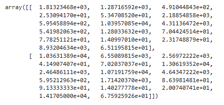
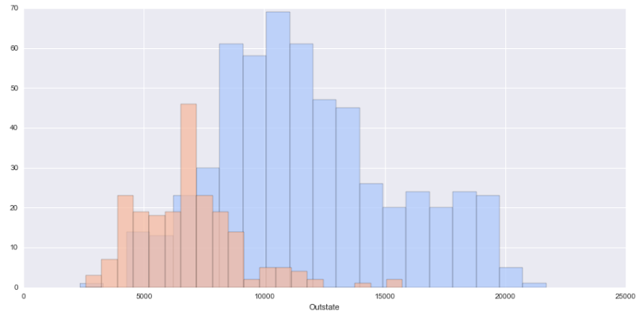
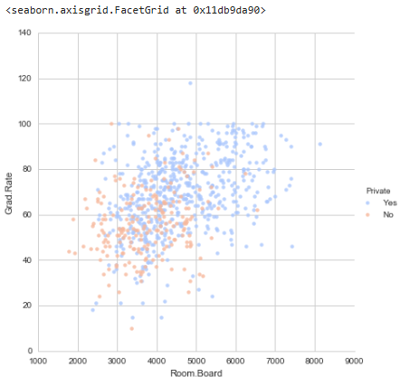
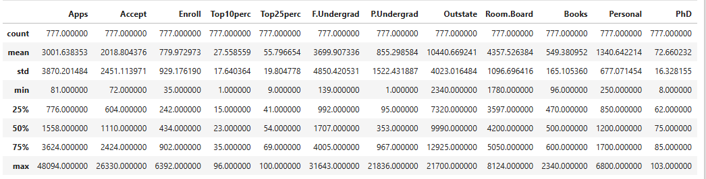

# 🎓 University Clustering with K-Means

**An elegant solution for classifying universities into Private and Public categories using K-Means clustering.**

## 🌟 Project Essence

- Pure Unsupervised Learning: Finding patterns without using existing labels

- Real Education Data: 777 universities with 18 meaningful characteristics

- Visual Storytelling: Beautiful data visualizations that speak volumes

## 📊 What You'll Discover

- How K-Means identifies clusters in complex education data

- The relationship between university features and their classification

- Insights into unsupervised learning performance

## Visual representations of high-dimensional data

## 🚀 Quick Start
**Clone and explore:**

git clone https://github.com/safikasi/K-Means-Clustering-Project.git

cd K-Means-Clustering-Project

pip install -r requirements.txt

## 🌐 Connect With Me

**Safwan Khan Kasi**  
DS & ML Enthusiast   

